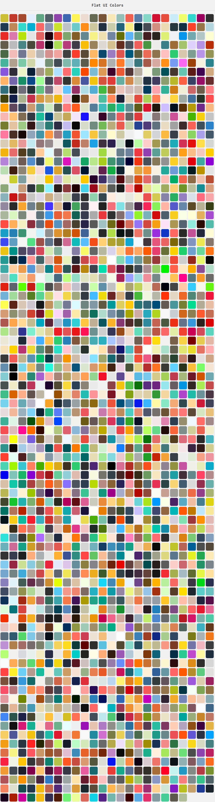

Flat UI Colors
===================

Hand picked **2109** Flat colors for your next project.

#### Install
```
$ npm install --save flat-ui-colors
$ npm install --global flat-ui-colors // for cli 
```

#### Usage

```javascript
var flatUiColors = require('flat-ui-colors').default; //or
import flatUiColors from 'flat-ui-colors'; //for es6 modules

//list all colors
flatUiColors.get.all();

//list random color
flatUiColors.get.one(); // returns one color

//list random number of colors
flatUiColors.get.many(5); //returns 5 colors

//export colors to a nice looking html page :)
flatUiColors.export.html(); // or with a filename
flatUiColors.export.html('filename');

// get collection of colors
flatUiColors.collection.all();

// get individual color collection
// supported colors: blue, red, pink, purle, green, yellow, orange, gray
flatUiColors.collection.get('blue');

```

#### CLI usage

```shell

//list all colors
$ flatc -a

//list random color
$ flatc -o

//list random number of colors
$ flatc -m 22

// colorname: blue, red, pink, purle, green, yellow, orange, gray
$ flatc -c <colorname>

//export as html
$ flatc -h <filename>
```
#### Example


